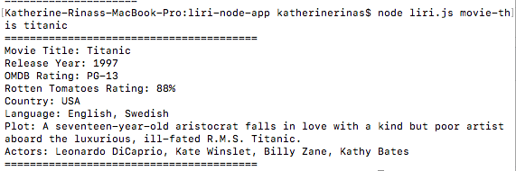

# liri-node-app

Welcome to the Liri Node app!!

How it works:

Use the terminal command line to call functions, such as reading Tweets, pulling songs from Spotify, and pulling movie data from the OMDB movie database. 
The command "node liri.js my-tweets" will pull up your most recent tweets from Twitter (up to 20 at a time!).
The command "node liri.js spotify-this < song name>" will pull up artist, song name, and album title from Spotify.
The command "node liri.js movie-this < movie name>" will pull up information on the year it was made, the actors, plot, and rotten tomatoes/OMDB ratings. For movies with more than one word in the title, it will be useful to put the title in quotes.
The command "node liri.js do-what-it-says" will pull up a random song.

enjoy Liri!!

Languages used:

HTML/CSS/JAVASCRIPT/NODE

